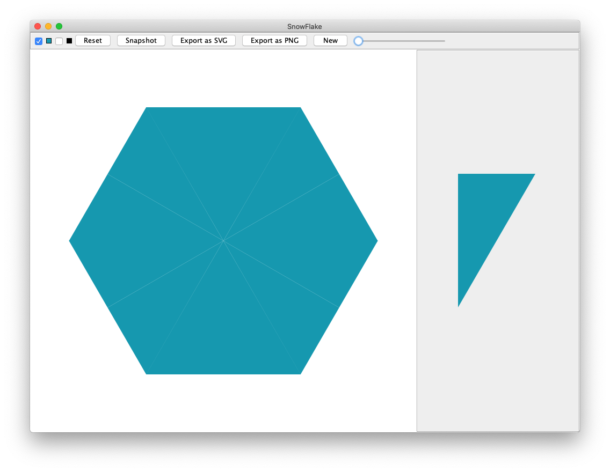

1. [Introduzione](#introduzione)

  - [Informazioni sul progetto](#informazioni-sul-progetto)

  - [Abstract](#abstract)

  - [Scopo](#scopo)

1. [Analisi](#analisi)

  - [Analisi del dominio](#analisi-del-dominio)
  
  - [Analisi dei mezzi](#analisi-dei-mezzi)

  - [Analisi e specifica dei requisiti](#analisi-e-specifica-dei-requisiti)

  - [Use case](#use-case)

  - [Pianificazione](#pianificazione)

1. [Progettazione](#progettazione)

  - [Design dell’architettura del sistema](#design-dell’architettura-del-sistema)

  - [Design dei dati e database](#design-dei-dati-e-database)

1. [Implementazione](#implementazione)

1. [Test](#test)

  - [Protocollo di test](#protocollo-di-test)

  - [Risultati test](#risultati-test)

  - [Mancanze/limitazioni conosciute](#mancanze/limitazioni-conosciute)

1. [Consuntivo](#consuntivo)

1. [Conclusioni](#conclusioni)

  - [Sviluppi futuri](#sviluppi-futuri)

  - [Considerazioni personali](#considerazioni-personali)

1. [Sitografia](#sitografia)

1. [Allegati](#allegati)


## Introduzione

### Informazioni sul progetto
Progetto individuale del primo semestre del terzo anno della ***SAMT*** (Scuola d'Arti e Mestieri di Trevano), 2019 - 2020.
Sono coinvolte le classi *I3AA* e *I3AC*; tutti gli allievi hanno lo stesso progetto da svolgere.

I professori ***Luca Muggiasca***  e ***Geo Petrini***q sono i richiedenti del progetto SnowFlake.

### Abstract
 
Prima di avere a disposizione il software **SnowFlake** ogni fiocco di neve doveva essere creato sulla carta con un paio di forbici; in alternativa si sarebbe potuto utilizzare software simili a quello creato, ma nessuno di essi era completo di tutte le funzionalità che si hanno a disposizione.

Senza il supporto di un software di autogenerazione non era possibile progettare uno schema di taglio per creare un fiocco di neve; prima si sarebbe dovuto disegnare precedentemente sul foglio di carta per poi piegarlo e trovare lo schema di taglio. Un lavoro infinito.

Con questo software è possibile provare vari schemi di taglio senza sprecare carta, in modo più **veloce**, **pratico** e **intuitivo**, in quantità illimitata


## Analisi

### Analisi del dominio

Il prodotto verrà utilizzato principalmente da utenti dalla medio-bassa conoscenza informatica, perciò l'interfaccia utente dovrà essere intuitiva ed il prodotto dovrà equipaggiare una piccola guida di utilizzo.
Gli utenti che utilizzeranno tale software sono persone che esercitano hobby di manualità e di bricolage.


### Analisi e specifica dei requisiti

|**ID**|**Nome**|**Priorità**|**Versione**|**Note**|
|---|---|---|---|-----|
| 001 | Dev'essere creato un sito adibito al download e alla descrizione/guida del progetto | 1 | 1.0 |...|
| 002 | I punti di taglio sono inseriti con un semplice click| 1 | 1.0 |...|
| 003 | Il percorso deve avere la funzione "Reset" I punti si possono rimuovere con il click destro, mentre cliccando su un punto già esistente lo si può spostare. | 1 | 1.0 |...|
| 004 | Il fiocco di neve viene generato in tempo reale. | 1 | 1.0 |...|
| 005 | L'utente può salvare il fiocco di neve in un file SVG o in un file PNG e può scegliere la cartella nella quale immagazzinarli. Nel caso del PNG si deve scegliere la risoluzione dell'immagine. | 1 | 1.0 |...|
| 006 | L'utente può salvare i punti di taglio in un file serializzato; al momento del salvataggio può scegliere il path nel quale salvarlo | 1 | 1.0 |...|
| 007 | La finestra deve avere dimensioni minime di 1024x768 e dev'essere ridimensionabile | 1 | 1.0 |...|
| 008 | L'utente può caricare un percorso di taglio precedentemente salvato. | 1 | 1.0 |...|
| 009 | All'avvio del programma viene mostrata una maschera dove si può scegliere se creare un nuovo fiocco di neve oppure aprire un file con un percorso di taglio già esistente, dove sono presenti i crediti e i link al sito web e a github | 1 | 1.0 |...|

### Use case
Lo schema sottostante descrive l'use case del software.


### Pianificazione


### Analisi dei mezzi
I mezzi che abbiamo a disposizione per la creazione del progetto sono:

|Nome|Versione|Fase|
|---|---|---|
|Microsoft Project®|?|Analisi|
|Oracle Java®|12.0|Sviluppo|
|Apache NetBeans®|11.1|Sviluppo|
|MacDown®|0.7.1|Documentazione|
|Oracle API JavaDoc|12.1|Informazione|
|Apache Batik Libraries|2.0|Tools programmazione|


L'applicazione verrà sviluppata su piattaforma **macOS** 10.15 ma sarà utilizzabile su qualsiasi macchina abbia installata la ***JRE*** (*Java Runtime Environment*).

## Progettazione


## Implementazione
Le classi create, come si può vedere dalla progettazione sono 5:

1. SnowFlake.java
2. MainFrame.java
3. SnowFlakePanel.java
4. TrianglePanel.java
5. Triangle.java

###SnowFlake

La classe *SnowFlake* (*JDialog*) si occupa di fornire all'utente una comoda ed intuitiva GUI nella quale può scegliere se aprire un nuovo documento *SnowFlake* oppure se aprirne uno esistente. Inoltre vi sono i link a tutte le piattaforme sociali dell'autore, incluso il sito web adibito al progetto.

Questa funzionalità è permessa dal metodo *browse()*, sviluppato personalmente.

```java
public void browse(String url){
    try{
        java.awt.Desktop.getDesktop().browse(java.net.URI.create(url));
    }catch(IOException e){
    }
}
```
Inoltre nel *JDialog* appaiono due pulsanti (*JButton*) i quali possono creare una nuova istanza MainFrame oppure aprire un file SnowFlake.

L'apertura di un file esterno è possibile tramite un *JFileChooser*, sul quale è stato applicato un filtro sul tipo di file `.snowflake`.

```java
private void OpenFlakeActionPerformed(java.awt.event.ActionEvent evt) {                                          
    JFileChooser jfc = new JFileChooser();
    FileNameExtensionFilter fnf = new FileNameExtensionFilter("Snowflake file (*.snowflake)", "snowflake");
    jfc.setFileFilter(fnf);
    jfc.showDialog(this, "Open");
    try{
        String handle = new String(jfc.getSelectedFile().toString());
        MainFrame sfp = new MainFrame(true, handle);
        this.dispose();
        sfp.setVisible(true);
    }catch(NullPointerException npe){
    } 
}
```
Il tasto "+" apre una nuova istanza *MainFrame*, permettendo all'utente di creare un fiocco di neve da zero.

```java
private void NewFlakeActionPerformed(java.awt.event.ActionEvent evt) {                                         
    this.dispose();
    MainFrame sfp = new MainFrame(false, "");
    sfp.setVisible(true);
}                                        
```
###MainFrame

La classe *MainFrame* contiene l'area di lavoro dove l'utente può eseguire tutte le operazioni grafiche e di salvataggio sul fiocco di neve. In questa classe sono contenuti *SnowFlakePanel* e *TrianglePanel*.

La classe contiene inoltre un *JPanel*, chiamato *controlsPanel*, che contiene tutti i pulsanti visibili nella barra in alto e una *JToolBar*, chiamata *triangleToolBar*, che contiene il triangolo sul quale vengono svolte le operazioni di taglio.
####triangleToolBar
Nella toolbar *triangleToolBar* sono contenuti tutti gli *Swing controls* necessari all'utente per poter eseguire azioni sul fiocco di neve.

**Controlli:**

* Selettore di riempimento del fiocco di neve [*JCheckBox*] 
	* Seleziona/deseleziona la visibilità dello riempimento del fiocco di neve.

* Selettore di colore di riempimento del fiocco di neve [*JPanel*]
	* Seleziona il colore di riempimento del fiocco di neve, tramite un *JColorChooser*, nel quale è possibile  scegliere un colore con un selettore RGB, HSV, HSL, CMYK e da una pagina "Swatches".
	
		```java
		private void fillPreviewPanelMouseClicked(java.awt.event.MouseEvent evt) {                                              
	        JColorChooser jcc = new JColorChooser();
	        Color c = jcc.showDialog(null, "Select a color", Color.BLACK);
	        snowFlakePanel.fillColor = c;
	        snowFlakePanel.repaint();
	        trianglePanel.fillColor = c;
	        trianglePanel.repaint();
	        fillPreviewPanel.setBackground(c);
	        fillPreviewPanel.repaint();
	    }
		``` 
* Selettore di bordo del fiocco di neve [*JCheckBox*]
	* Seleziona/deseleziona la visibilità del bordo del fiocco di neve.

* Selettore di colore del bordo del fiocco di neve [*JPanel*]
	* Seleziona il colore del bordo del fiocco di neve, tramite un *JColorChooser*, nel quale è possibile  scegliere un colore con un selettore RGB, HSV, HSL, CMYK e da una pagina "Swatches".
	
		```java
	    private void strokePreviewPanelMouseClicked(java.awt.event.MouseEvent evt) {                                                
	       JColorChooser jcc = new JColorChooser();
	       Color c = jcc.showDialog(null, "Select a color", Color.BLACK);
	       snowFlakePanel.strokeColor = c;
	       snowFlakePanel.repaint();
	       trianglePanel.strokeColor = c;
	       trianglePanel.repaint();
	       strokePreviewPanel.setBackground(c);
			strokePreviewPanel.repaint();
		}    
		```
* Tasto "Reset", per rimuovere ogni punto di taglio inserito [*JButton*]
	* Cancella tutti i punti di taglio di TrianglePanel.
* Tasto "Snapshot", per salvare i punti di taglio [*JButton*]
	* I punti di taglio vengono serializzati in un file `.snowflake`.
* Tasto "Export as SVG" per esportare il fiocco di neve in SVG [*JButton*]
	* L'immagine vettoriale viene salvata in un file ```.svg```.
* Tasto "Export as PNG" per esportare il fiocco di neve in PNG [*JButton*]
 	* L'immagine vettoriale viene salvata in un file ```.svg```.
* Tasto "New" per chiudere l'istanza corrente di MainFrame e riaprire *SnowFlake* [*JButton*]
	* Viene avvisato l'utente della possibile perdita di modifiche e riapre l'istanza 
* Slider per modificare il diametro dei punti cardine del poligono di taglio [*JSlider*]
	* I punti cardine possono passare da un minimo di 5 px a 20 px di raggio.

###TrianglePanel

###SnowFlakePanel
La classe *SnowFlakePanel* contiene unicamente la versione generata del fiocco di neve.
Questa classe genera un anteprima "live" del fiocco di neve, man mano che si aggiungono punti di taglio.
Questo è permesso dal triangolo tagliato in *TrianglePanel*, passato con un attributo nella classe.

I triangoli che compongono il fiocco di neve vengono posizionati e roteati tramite l'utilizzo della classe *AffineTransform*:
####flipArea
Il metodo *flipArea* si occupa di specchiare il triangolo in modo da posizionarlo in modo adatto, in quanto ad occorrenza alterna serve una versione specchiata.

```java
public Shape flipArea(Area origArea) {
    AffineTransform mirror = new AffineTransform();
    mirror.scale(-1, 1);
    AffineTransform toBorder = new AffineTransform();
    toBorder.translate(-center.x * 2, 0);
    AffineTransform concat = new AffineTransform();
    concat.concatenate(mirror);
    concat.concatenate(toBorder);
    return concat.createTransformedShape(origArea);
}
```

####rotateArea
Il metodo *rotateArea* si occupa di roteare il triangolo, specificando l'ampiezza della rotazione in gradi. Questo triangolo viene roteato 6 volte di 60°, nel caso il triangolo venga specchiato non è necessario aggiungere ulteriore rotazione rispetto quello adiacente in quanto la specchiatura già provvede a ciò.

```java
public Shape rotateArea(Shape origPoints, double angle) {
    AffineTransform tx = new AffineTransform();
    tx.rotate(Math.toRadians(angle), this.center.x, this.center.y);
    return tx.createTransformedShape(origPoints);
}
```

####translateToCenter
Il metodo *translateToCenter* si occupa di traslare il triangolo al centro del pannello.

```java
public Shape translateToCenter(Shape origShape){
    AffineTransform toBorder = new AffineTransform();
    toBorder.translate(-this.center.x, -this.center.y);
    AffineTransform toCenter = new AffineTransform();
    toCenter.translate(this.getWidth()/2, this.getHeight()/2);
    AffineTransform concat = new AffineTransform();
    concat.concatenate(toBorder);
    concat.concatenate(toCenter);
    return concat.createTransformedShape(origShape);
}
```

In questa classe sono presenti anche i metodi per il salvataggio del fiocco di neve come immagine, sia vettoriale che raster.

####generateSVG
Il metodo *generateSVG* si occupa di copiare l'output stampato sul pannello *SnowFlakePanel* su un file SVG, utilizzando la libreria *SVGGraphics2D*, offerta da *Apache*.

```java
public void generateSVG(String filename){
    DOMImplementation domImpl =
    GenericDOMImplementation.getDOMImplementation();
    String svgNS = "http://www.w3.org/2000/svg";
    Document document = domImpl.createDocument(svgNS, "svg", null);
    SVGGraphics2D svgGenerator = new SVGGraphics2D(document);
    this.paintComponent(svgGenerator);
    boolean useCSS = true;
    Writer out;
    try {
        svgGenerator.stream(filename, useCSS);
    } catch (SVGGraphics2DIOException ex) {
        JOptionPane jop = new JOptionPane();
        jop.showOptionDialog(
                null,
                "Graphic error. Code: sf206",
                "Graphic error",
                JOptionPane.DEFAULT_OPTION,
                JOptionPane.ERROR_MESSAGE,
                null, null, null);
    }
}
```

####generatePNG
Il metodo *generatePNG* si occupa di copiare l'output stampato sul pannello *SnowFlakePanel* su un file PNG.

```java
public void generatePNG(String filename, int width){
    try {
        BufferedImage buffImg = new BufferedImage
            (width, width, BufferedImage.TYPE_INT_ARGB);
        Graphics2D g2d = buffImg.createGraphics();
        try{        
            Area triangle = this.tf.triangle;
            this.center = new Point(this.tf.center.x, this.tf.center.y);
            for (int i = 6; i <= 36; i += 6) {
                if(this.fill){
                    g2d.setColor(this.fillColor);
                    g2d.fill(translateToSide(rotateArea(flipArea(triangle), i*10)));
                    g2d.fill(translateToSide(rotateArea(triangle, i*10)));
                }
                if(this.stroke){
                    g2d.setColor(this.strokeColor);
                    g2d.draw(translateToSide(rotateArea(flipArea(triangle), i*10)));
                    g2d.draw(translateToSide(rotateArea(triangle, i*10)));
                }
            }
        }catch(Exception ex){
        }
        ImageIO.write(buffImg, "PNG", new File(filename));
    } catch (IOException ie) {
        JOptionPane jop = new JOptionPane();
        jop.showOptionDialog(
                null,
                "Cannot create file",
                "Error creating file",
                JOptionPane.DEFAULT_OPTION,
                JOptionPane.ERROR_MESSAGE,
                null, null, null);
    }
}
```

Per salvare il file PNG è inoltre necessario portare l'esagono del fiocco di neve al bordo del pannello con *AffineTransform*; ciò è stato fatto tramite il metodo *translateToSide*.

```java
public Shape translateToSide(Shape origPoints){
    AffineTransform toBorder = new AffineTransform();
    toBorder.translate(-this.center.x, -this.center.y);
    AffineTransform toCenter = new AffineTransform();
    toCenter.translate(300, 300);
    AffineTransform concat = new AffineTransform();
    concat.concatenate(toBorder);
    concat.concatenate(toCenter);
    return concat.createTransformedShape(origPoints);
}
```

###TrianglePanel
La classe *TrianglePanel* contiene unicamente il fiocco di neve "piegato", ovvero non generato (solo in triangolo). Questa classe si occupa anche di gestire l'aggiunta/rimozione dei punti di taglio.
In questa classe sono presenti tutti i listener necessari per gestire tutti gli input del mouse, ovvero il click ed il trascinamento.

In questa classe sono presenti i seguenti attributi:
- 

####MouseClicked
Nel metodo *MouseClicked* viene gestito l'input di click del mouse. Vengono distinti due tipi di input: quello del tasto sinistro e quello del tasto destro.
In caso di click con tasto sinistro viene aggiunto un punto al poligono di taglio.
In caso di click con tasto destro destro viene rimosso il punto sul quale ci si trova.
```java
private void formMouseClicked(java.awt.event.MouseEvent evt) {                                  
    if (evt.getButton() == evt.BUTTON1) {
        if(
                evt.getX() > 0 && 
                evt.getY() > 0 &&
                evt.getX() < this.getWidth() && 
                evt.getY() < this.getHeight()){
                    this.poly.addPoint(evt.getX(), evt.getY());
                    this.points.add(evt.getPoint());
        }
    } else if (evt.getButton() == evt.BUTTON3) {
        for (Point point : points) {
            if (evt.getPoint().distance(point) <= this.RAD) {
                this.points.remove(point);
                break;
            }
        }
        this.poly.reset();
        int[] x = new int[points.size()];
        int[] y = new int[points.size()];
        for (int i = 0; i < this.points.size(); i++) {
            x[i] = this.points.get(i).x;
            y[i] = this.points.get(i).y;
            this.poly = new Polygon(x, y, this.points.size());
        }
    }
    repaint();
    updateGraphics();
    firePropertyChange();
}                                 
```

####MouseDragged
Nel metodo *MouseDragged* viene gestito l'input di trascinamento del mouse. Quando ci si trova sopra un punto esistente (all'interno del punto cardine) la posizione del punto del poligono viene aggiornato.

```java
private void formMouseDragged(java.awt.event.MouseEvent evt) {                                  
        if (evt.getButton() == evt.BUTTON1) {
            for (Point point : points) {
            if(evt.getPoint().distance(point) <= this.RAD){
                if(evt.getX() > this.RAD && evt.getY() > this.RAD){
                    if(evt.getX() < this.getWidth() - this.RAD
                            && evt.getY() < this.getHeight() - this.RAD){
                        int index = this.points.indexOf(point);
                        this.points.add(index, evt.getPoint());
                        this.points.remove(point);
                        break;
                    }
                }
            }
        }
        this.poly.reset();
        int[] x = new int[points.size()];
        int[] y = new int[points.size()];
        for (int i = 0; i < this.points.size(); i++) {
            x[i] = this.points.get(i).x;
            y[i] = this.points.get(i).y;
            this.poly = new Polygon(x, y, this.points.size());
        }
    }
    repaint();
    updateGraphics();
    firePropertyChange();
}
```

####serialize/deSerialize
I metodi *serialize* e *deSerialize* si occupano rispettivamente di salvare e caricare il poligono di taglio, usando la serializzazione degli oggetti.

```java
    public void serialize(File handle) {
        String path = handle.toString();
        try {
            FileOutputStream fileOut = new FileOutputStream(path);
            ObjectOutputStream out = new ObjectOutputStream(fileOut);
            out.writeObject(this.poly);
            out.close();
            fileOut.close();
        } catch (IOException i) {
            JOptionPane jop = new JOptionPane();
            jop.showOptionDialog(
                    null,
                    "Cannot write file " + handle + ". Code: tp158",
                    "Error opening file",
                    JOptionPane.DEFAULT_OPTION,
                    JOptionPane.ERROR_MESSAGE,
                    null, null, null);
        }
    }

    public void deSerialize(File handle) {
        String path = handle.toString();
        try {
            FileInputStream fileIn = new FileInputStream(path);
            ObjectInputStream in = new ObjectInputStream(fileIn);
            this.poly = (Polygon) in.readObject();
            if (!this.points.isEmpty()) {
                this.points.clear();
            }
            for (int i = 0; i < this.poly.npoints; i++) {
                this.points.add(
                        new Point(this.poly.xpoints[i], this.poly.ypoints[i]));
            }
            repaint();
            in.close();
            fileIn.close();
        } catch (IOException | ClassNotFoundException i) {
            JOptionPane jop = new JOptionPane();
            jop.showOptionDialog(
                    null,
                    "Cannot open file " + handle + ". Code: tp190",
                    "Error opening file",
                    JOptionPane.DEFAULT_OPTION,
                    JOptionPane.ERROR_MESSAGE,
                    null, null, null);
        }
        //recalculates all the components in the paintComponent method
        updateGraphics();
    }
```
####firePropertyChanged
In modo da aggiornare in modo sincronizzato il pannello contenente la generazione "live" ed il pannello del triangolo ad ogni azione su quest'ultimo è stato impiegato un metodo che lancia un'evento (verso *MainFrame*) ogni qualvolta ne che ne viene lanciato uno da *TrianglePanel*.

```java
public void firePropertyChange() {
    PropertyChangeEvent event = new PropertyChangeEvent(this, "Fired", 1, 1);
    PropertyChangeListener[] listeners = this.getPropertyChangeListeners();
    synchronized (listeners) {
        for (PropertyChangeListener l : listeners) {
            l.propertyChange(event);
        }
    }
}
```
####paintComponent
Nel metodo *paintComponent* vengono stampati tutti i componenti del pannello *TrianglePanel*, quali il triangolo tagliato, il poligono di taglio e la lista di punti, in modo da formare i punti cardine.

###Triangle
La classe triangolo si occupa di creare un modello di triangolo, usato sia da *TrianglePanel* che da *SnowFlakePanel*.
In questo modo non ci sarà bisogno di calcolare in ogni pannello le dimensioni di tale triangolo.
Questa classe calcola le dimensioni del triangolo in base alle dimensioni del pannello che lo andrà a contenere.
Vengono passati tutti gli argomenti necessari, quali altezza e larghezza del pannello contenitore,la larghezza fissa e l'array di punti (x e y) utile a disegnare il poligono.

## Test

### Protocollo di test

Definire in modo accurato tutti i test che devono essere realizzati per
garantire l’adempimento delle richieste formulate nei requisiti. I test
fungono da garanzia di qualità del prodotto. Ogni test deve essere
ripetibile alle stesse condizioni.


|Test Case| TC-001|
|---------------|--------------------------------------|
|**Nome**||
|**Riferimento**| REQ-001 |
|**Descrizione**||
|**Prerequisiti**||
|**Procedura**||
|**Risultati attesi** ||

|Test Case| TC-002|
|---------------|--------------------------------------|
|**Nome**|Inserimento punti|
|**Riferimento**| REQ-002 |
|**Descrizione**|L'utente deve poter inserire punti tramite il click sinistro del mouse sul triangolo|
|**Prerequisiti**|Apertura del programma, creazione di un nuovo Fiocco|
|**Procedura**|Clicco ripetutamente sul triangolo con il tasto sinistro|
|**Risultati attesi** |Creazione dei punti di taglio sopra al triangolo|

|Test Case| TC-003|
|---------------|--------------------------------------|
|**Nome**|Rimozione punti|
|**Riferimento**| - |
|**Descrizione**|L'utente deve poter rimuovere i punti tramite il click destro del mouse sul triangolo|
|**Prerequisiti**|Apertura programma, creazione di un nuovo fiocco, creazione di punti sul triangolo|
|**Procedura**|Clicco ripetutamente sul triangolo con il tasto destro sui punti.|
|**Risultati attesi** |Rimozione dei punti esistenti.|

|Test Case| TC-004|
|---------------|--------------------------------------|
|**Nome**|Spostamento punti|
|**Riferimento**| - |
|**Descrizione**|L'utente deve poter spostare i punti tramite il trascinamento dei punti con tasto sinistro del mouse|
|**Prerequisiti**|Apertura programma, creazione di un nuovo fiocco, creazione di punti sul triangolo|
|**Procedura**|Trascino con il click sinistro ripetutamente i punti di taglio|
|**Risultati attesi** |Spostamento di tali punti|

|Test Case| TC-005|
|---------------|--------------------------------------|
|**Nome**|Tasto reset|
|**Riferimento**| REQ-003 |
|**Descrizione**|Dev'essere presente un tasto "Reset" che rimuove tutti i punti presenti, lasciando un fiocco non tagliato|
|**Prerequisiti**|Apertura programma, creazione di un nuovo fiocco, creazione di punti sul triangolo|
|**Procedura**|Clicco sul tasto "Reset"|
|**Risultati attesi**|Rimozione di tutti i punti di taglio|

|Test Case| TC-006|
|---------------|--------------------------------------|
|**Nome**|Live preview|
|**Riferimento**| REQ-004 |
|**Descrizione**|Il fiocco di neve si deve generare in modo sincrono con la creazione di punti sul triangolo|
|**Prerequisiti**|Apertura del programma, creazione di un nuovo Fiocco|
|**Procedura**|Aggiungo, rimuovo e sposto ripetutamente i punti di taglio|
|**Risultati attesi** |Sincronizzazione istantanea dei tagli sul fiocco di neve|

|Test Case| TC-007|
|---------------|--------------------------------------|
|**Nome**|Salvataggio in SVG o PNG|
|**Riferimento**| REQ-005 |
|**Descrizione**|Il fiocco di neve si deve poter salvare in file di tipo SVG e PNG, quest'ultimo in dimensioni di 500x500 e 1000x1000|
|**Prerequisiti**|Apertura programma, creazione di un nuovo fiocco, creazione di punti sul triangolo|
|**Procedura**|Clicco sul tasto "Save as PNG" e "Save as SVG" e salvo in entrambe i formati|
|**Risultati attesi** |In entrambi i casi deve apparire un *JFileChooser* che permette di scegliere il file in cui salvare e, nel caso del PNG di scegliere la sua dimensione; dovrebbero poi apparire i file.|

|Test Case| TC-008|
|---------------|--------------------------------------|
|**Nome**|Salvataggio punti di taglio|
|**Riferimento**| REQ-006 |
|**Descrizione**|I punti di taglio possono essere salvati tramite serializzazione|
|**Prerequisiti**|Apertura programma, creazione di un nuovo fiocco, creazione di punti sul triangolo|
|**Procedura**|Clicco sul tasto "Snapshot" e scelgo, tramite il *JFileChooser* il file di destinazione|
|**Risultati attesi** |Creazione di un file ```.snowflake``` contenente l'oggetto ```Polygon``` salvato|


|Test Case| TC-009|
|---------------|--------------------------------------|
|**Nome**|Misura finestra|
|**Riferimento**| REQ-008 |
|**Descrizione**|La finestra deve avere una dimensione minima di 1024x768 e deve essere ridimensionabile|
|**Prerequisiti**|Apertura programma, creazione di un nuovo fiocco|
|**Procedura**|Trascino i bordi della finestra in modo da ridimensionarla|
|**Risultati attesi** |La finestra non ha mai grandezza inferiore a 1024x768|

|Test Case| TC-010|
|---------------|--------------------------------------|
|**Nome**|Caricamento salvataggio|
|**Riferimento**| REQ-009 |
|**Descrizione**|Si può caricare un file serializzato che carica punti di taglio esistenti|
|**Prerequisiti**|Apertura programma, apertura fiocco esistente|
|**Procedura**|Tramite un *JFileChooser* posso scegliere il file ```.snowflake```da caricare|
|**Risultati attesi** |Selezionando un file ```.snowflake``` vengono caricati i punti di taglio|

|Test Case| TC-011|
|---------------|--------------------------------------|
|**Nome**|Finestra iniziale|
|**Riferimento**| REQ-010 |
|**Descrizione**|Dev'essere presente una finestra iniziale la quale ha le opzioni di creare un nuovo fiocco oppure caricarne uno esistente|
|**Prerequisiti**|Apertura programma|
|**Procedura**|Apro il programma|
|**Risultati attesi** |Devono apparire due tasti, uno per aprire un nuovo fiocco, uno per caricarne uno esistente|

|Test Case| TC-011|
|---------------|--------------------------------------|
|**Nome**|Finestra iniziale|
|**Riferimento**| REQ-010 |
|**Descrizione**|Dev'essere presente una finestra iniziale la quale ha le opzioni di creare un nuovo fiocco oppure caricarne uno esistente|
|**Prerequisiti**|Apertura programma|
|**Procedura**|Apro il programma|
|**Risultati attesi** |Devono apparire due tasti, uno per aprire un nuovo fiocco, uno per caricarne uno esistente|

### Risultati test

Tutti i test sono stati adempiti correttamente e hanno dato risultato positivo, fatta eccezione per quello del salvataggio del PNG. Infatti il file PNG non può esere salvato in molteplici dimensioni, quali 500x500 e 1000x1000, ma solo in 600x600.

### Mancanze/limitazioni conosciute

Descrizione con motivazione di eventuali elementi mancanti o non
completamente implementati, al di fuori dei test case. Non devono essere
riportati gli errori e i problemi riscontrati e poi risolti durante il
progetto.

## Consuntivo


## Conclusioni

Quali sono le implicazioni della mia soluzione? Che impatto avrà?
Cambierà il mondo? È un successo importante? È solo un’aggiunta
marginale o è semplicemente servita per scoprire che questo percorso è
stato una perdita di tempo? I risultati ottenuti sono generali,
facilmente generalizzabili o sono specifici di un caso particolare? ecc

### Sviluppi futuri
Ne progetto possono essere aggiunte sono molteplici, come per esempio la possibilità di aggiungere molteplici poligoni, la  possibilità di salvare il file PNG in diverse risoluzioni, e molte altre.
Essendo un prodotto basato sulla creatività le possibili funzionalità sono moltissime.

### Considerazioni personali
Da questo progetto ho imparato gestire un mandato, il quale potrebbe venire da un superiore oppure da un cliente, ho imparato a gestire in modo più efficiente il tempo a disposizione e a capire come dividerlo tra le vari requisiti richiesti.
Ho inoltre imparato ad utilizzare una piattaforma Git.
## Bibliografia


### Sitografia

-   https://xmlgraphics.apache.org/batik/using/svg-generator.html, *Apache Batik SVGGraphics2D*, 30-11-2019.

## Allegati

- Diari di lavoro da 06-09-2019 a 20-12-2019
- Codice sorgente (Progetto NetBeans)
- GANTT progetto (.pod)
- Archivio installazione per macOS
- Archivio installazione per Windows/Linux
